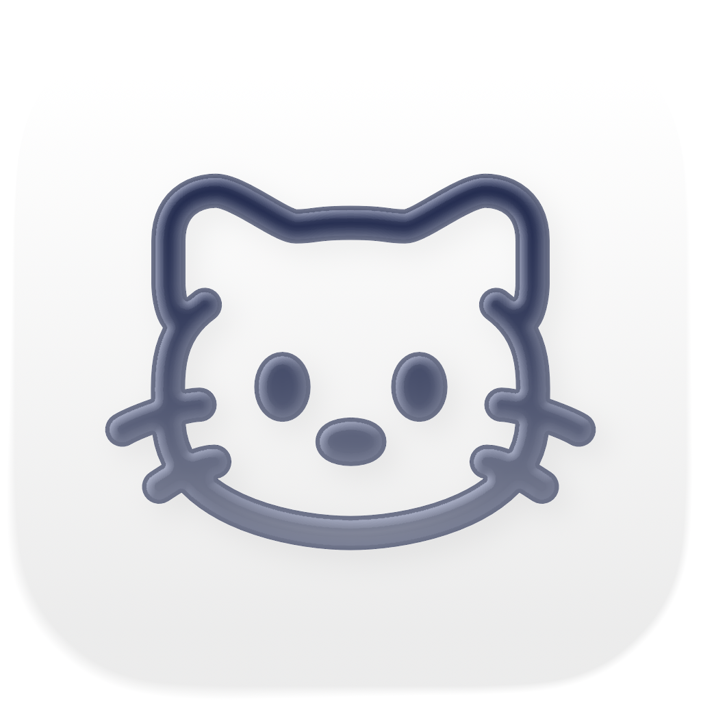
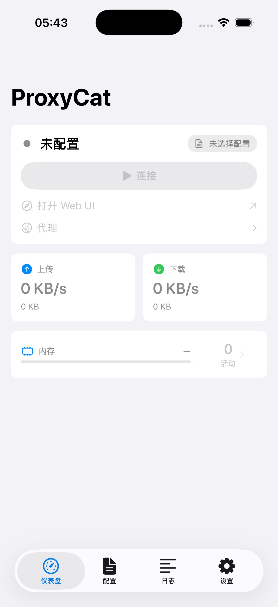
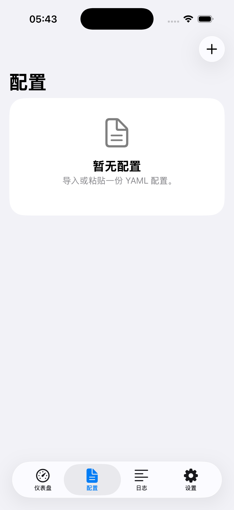
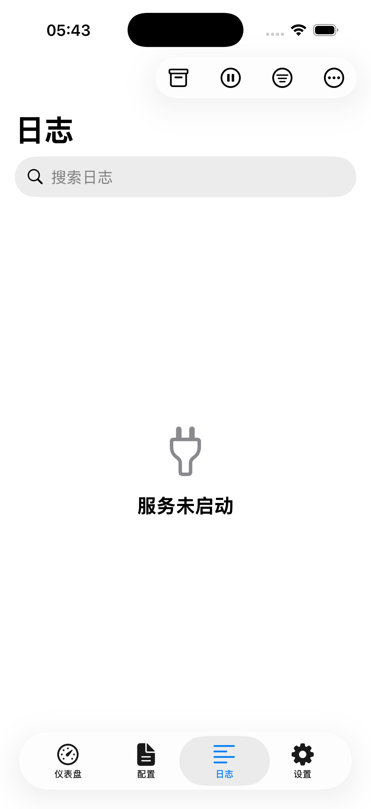
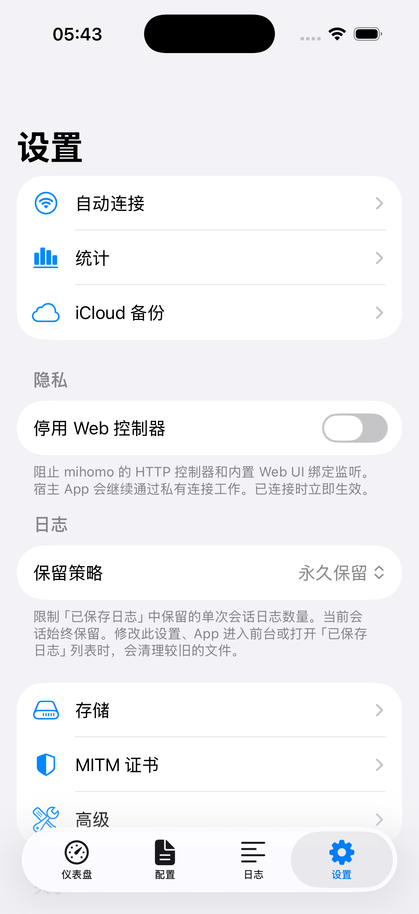
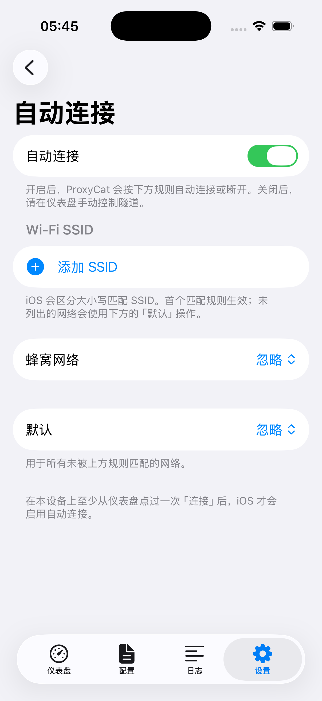
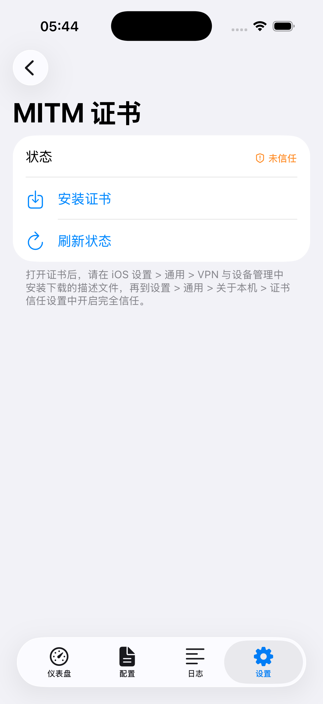
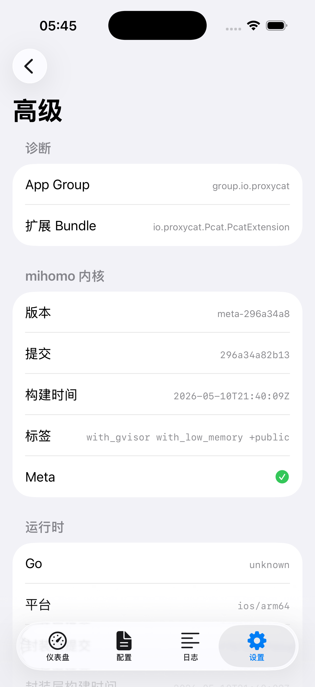

<p align="center">
  
</p>

# ProxyCat

[mihomo](https://github.com/MetaCubeX/mihomo) 的原生 iOS 客户端。架构参考 [sing-box-for-apple](https://github.com/SagerNet/sing-box-for-apple)：SwiftUI 宿主 App 通过 `NEPacketTunnelProvider` 扩展承载网络隧道，扩展内嵌一份由 `gomobile` 生成的 mihomo XCFramework。

应用图标使用 Xcode 26 的 Icon Composer 格式（`AppIcon.icon/`），单一 SVG 源 + `icon.json` 描述图层、阴影、半透明，在打包时自动渲染出 iOS 26 Liquid Glass 所需的全部尺寸/外观（Default / Tinted / Dark / Clear）。

> [!NOTE]
> **TestFlight 公测即将开放 / TestFlight beta coming very soon** — 公开邀请链接将很快在此 README 发布，敬请关注本仓库。

## 截图

| Dashboard | Profiles | Logs | Settings |
|:---:|:---:|:---:|:---:|
|  |  |  |  |
| 状态 / 流量 / 内存预算 / 活动连接 | YAML 配置管理 | 等级筛选 + 搜索 + 复制 | Auto Connect / 统计 / iCloud 备份 / 存储 / MITM 证书 |

| Auto Connect | MITM Certificate | Diagnostics |
|:---:|:---:|:---:|
|  |  |  |
| SSID / 蜂窝 / 默认动作 | 本地根证书安装与信任 | App Group / 内核版本 / 构建标签 |

## 本地化文案风格

ProxyCat 的简体中文与日文本地化采用统一的产品文案风格：

- **语气**：简洁、中性、偏 iOS 系统设置风格；按钮和菜单使用短动词（如“保存”“取消”“重置”），提示语直接说明结果或前置条件。
- **术语**：`profile` 统一译为“配置”，`Dashboard` 统一译为“仪表盘”，`Statistics` 译为“统计”，`Saved Logs` 译为“已保存日志”，`Web UI` 保留英文写法。
- **日文术语**：`profile` 统一译为“プロファイル”，`Dashboard` 统一译为“ダッシュボード”，`Statistics` 译为“統計”，`Saved Logs` 译为“保存済みログ”，`Web UI` 保留英文写法。
- **技术名词**：保留 `ProxyCat`、`mihomo`、`YAML`、`SSID`、`Wi-Fi`、`HTTP`、`URL`、`VPN`、`TUN`、`gRPC`、`App Group`、`GitHub`、`Go`、`iOS` 等原文。
- **标点**：中文句子使用全角标点（`，。？！；（）`），日文句子使用日文标点（`、。`）；UI 名称引用使用中文 / 日文引号（`「…」`）；占位符（如 `%@`、`%lld`）和路径、命令、协议名保持原样。
- **一致性**：相同功能入口在不同页面使用同一译名；说明文字不混用“链接 / URL”“仪表板 / 仪表盘”“网页 UI / Web UI”等变体。

## 目录结构

```
proxycat/
├── libmihomo/              Go gomobile 包装层。对外暴露一个极简的 C 友好接口：
│   ├── binding.go          生命周期（Start / Reload / Stop）、路径配置、TUN fd 注入、Version
│   ├── settings.go         读取宿主写入的 runtime_settings.json（active profile + 运行时偏好的真源）
│   ├── command_server.go   扩展内的 gRPC 服务（Status + Logs 流，日志事件含 timestamp_ns）
│   ├── command_client.go   宿主侧 gRPC 客户端，回调通过 gomobile 抛回 Swift
│   ├── log_pump.go         单点 helper：订阅 mihomo log.Subscribe() 并把事件灌进给定 handler
│   ├── log_persist.go      把每次会话的日志写到 App Group 的滚动文件中（log_pump 的消费者）
│   ├── traffic.go          上下行 / 总流量 / 连接数快照
│   ├── oom.go              移植自 sing-box 的 OOM 守护，应对 NE jetsam
│   ├── proto/command/      gRPC 协议定义（Status / Log）
│   └── tools.go            固定 golang.org/x/mobile/bind 依赖（gobind 需要）
├── scripts/
│   └── build-libmihomo.sh  gomobile bind → Frameworks/Libmihomo.xcframework
├── Library/                共享 Swift framework：
│                           AppConfiguration（共享常量）/ FilePath（AppGroup 路径）/
│                           LibmihomoBridge / ExtensionProfile / ExtensionEnvironment /
│                           ExtensionCoordinators（VPN 生命周期 / 设置 / Auto Connect / 流量）/
│                           CommandClient / MihomoController / ControllerTransport /
│                           RuntimeSettings / HostSettingsStore / JSONFileStore /
│                           Profile / ProxiesStore / ConnectionsStore /
│                           DailyUsage / DailyUsageStore / AutoConnect /
│                           ICloudBackup / SavedLogFile /
│                           TrafficSnapshot / LogEntry / Observed / ExponentialBackoff /
│                           BundledAssets / MemoryMonitor
├── ApplicationLibrary/     SwiftUI 视图：Dashboard / Profiles (含编辑器与下载) /
│                           Logs (含 SavedLogs) / Connections / Proxies /
│                           Settings (含 Statistics / AutoConnect / iCloudBackup /
│                           Storage / MitmCertificate / Advanced)
├── Pcat/                   iOS App target（入口、Info.plist、entitlements）
├── PcatExtension/          Network Extension target（PacketTunnelProvider）
├── AppIcon.icon/           Xcode 26 Icon Composer 资源（单一 SVG + icon.json 图层描述）
├── docs/                   ProxyCat 专属文档（MITM 证书与 YAML 配置等）
├── Tests/LibraryTests/     Swift Testing 套件 — ExponentialBackoff / RetryLoop / JSONFileStore /
│                           AutoConnect / DailyUsage / MemoryStats / TrafficSnapshot /
│                           ByteFormatter / LogEntry / Profile codable / MihomoController，
│                           运行: `xcodebuild test -scheme Library`
├── project.yml             XcodeGen 描述文件 — 用于（重新）生成 ProxyCat.xcodeproj
├── Makefile                构建编排
└── sample-profile.yaml     最小可用的 mihomo 配置示例
```

## 环境要求

```bash
brew install xcodegen
go install golang.org/x/mobile/cmd/gomobile@latest
go install golang.org/x/mobile/cmd/gobind@latest
gomobile init
```

mihomo 源码以 git submodule 形式 vendored 在 `proxycat/mihomo/`，跟踪上游 `Meta` 分支。`libmihomo/go.mod` 中的 `replace` 指向该子模块。

```bash
git clone --recurse-submodules <proxycat repo>
# 或者已经 clone 过：
make mihomo-init        # 等价于 git submodule update --init --recursive mihomo
```

升级到最新 Meta tip 并重建 xcframework：

```bash
make mihomo-upgrade     # checkout origin/Meta + ./scripts/build-libmihomo.sh
git add mihomo && git commit -m "Bump mihomo to <sha>"
```

或者钉到指定的 tag / commit / 分支（不跟踪 Meta tip）：

```bash
make mihomo-checkout REF=v1.19.5         # 锁定到一个稳定 tag
make mihomo-checkout REF=35d5d4e44d7a    # 锁定到具体 commit
make mihomo-checkout REF=Meta            # 等效于 mihomo-upgrade（取 origin/Meta 当前 tip）
git add mihomo && git commit -m "Pin mihomo to <sha> (<ref>)"
```

`mihomo-upgrade` / `mihomo-checkout` 会先 `git fetch --tags origin`，再以 detached HEAD 方式 checkout 给定的 ref，最后调用 `./scripts/build-libmihomo.sh` 重建 xcframework。

`libmihomo/tools.go` 显式 import 了 `golang.org/x/mobile/bind`。没有这个文件 `gomobile bind` 会报错 `unable to import bind: no Go package in golang.org/x/mobile/bind`，因为 `go mod tidy` 会把没有源码引用的依赖剪掉，而 `gobind` 只在临时目录里 import 它。

## 首次构建

```bash
cd proxycat
export XCODE_DEVELOPMENT_TEAM=ABCDE12345  # your Apple Team ID
make assets       # 下载 GeoIP / GeoSite / mmdb 与 metacubexd（仓库只跟踪 .gitkeep）
make all          # 构建 xcframework + 生成 xcodeproj
open ProxyCat.xcodeproj
```

`make project` / `make all` 会从 `XCODE_DEVELOPMENT_TEAM` 自动填入 `DEVELOPMENT_TEAM`。未设置时生成的项目不会写入开发者团队；真机构建或 Archive 前需要设置该环境变量，或临时在 Xcode 中选择 Team。`make sim` 会先重新生成项目并关闭签名；`make build` 会先检查 `XCODE_DEVELOPMENT_TEAM`，再重新生成项目和执行真机构建。

常用 Make target：

| target            | 说明                                                   |
|-------------------|--------------------------------------------------------|
| `make libmihomo`      | 仅重建 `Frameworks/Libmihomo.xcframework`              |
| `make project`        | 运行 `xcodegen` 并自动注入版本号与 `XCODE_DEVELOPMENT_TEAM`（见下） |
| `make version`        | 打印下一次 `make project` 会写入的版本/编号            |
| `make all`            | `mihomo-init` + `libmihomo` + `project`，首次 clone 后跑一次 |
| `make all-obf`        | `mihomo-init` + obfuscated `libmihomo` + `project`，用于提交前构建 |
| `make mihomo-init`    | 初始化或刷新 `mihomo/` submodule                       |
| `make mihomo-upgrade` | 拉取最新 Meta tip 并重建 xcframework                   |
| `make mihomo-checkout REF=<ref>` | 钉到指定 tag / commit / 分支并重建 xcframework |
| `make assets`         | 下载 geo 资源与 metacubexd 到 `BundledAssets/`         |
| `make geo-assets` / `ui-assets` / `clean-assets` | 仅刷新 / 清空对应子集 |
| `make sim`            | 不签名地为 iOS 模拟器构建                              |
| `make build`          | 真机构建（需要签名）                                   |
| `make clean`          | 清理生成产物                                           |

## 版本与显示信息

应用元数据集中在 `project.yml` 中，由 `xcodegen` 写入 `ProxyCat.xcodeproj`，再由 Xcode 在编译时合并到 `Info.plist`：

| 项目                  | 来源                                                       | Xcode Target → General 字段 |
|-----------------------|------------------------------------------------------------|------------------------------|
| Marketing version     | `VERSION` 文件（手动 bump）                                | Version                      |
| Build number          | `git rev-list --count HEAD`（自动单调递增）                | Build                        |
| Display Name          | `INFOPLIST_KEY_CFBundleDisplayName`（`project.yml`）       | Display Name                 |
| App Category          | `INFOPLIST_KEY_LSApplicationCategoryType`                  | Category                     |

调用链：`make project` → `scripts/generate-project.sh` 读取 `VERSION` 与 git，导出 `PROXYCAT_MARKETING_VERSION` / `PROXYCAT_BUILD_NUMBER`，并透传 `XCODE_DEVELOPMENT_TEAM`，由 `project.yml` 的 `${...}` 占位符插入。

要发布新版只需 `echo 1.0.0 > VERSION && make project`；build number 会随 commit 自动递增，无需手动维护。需要临时覆盖时（例如手工 archive 至 TestFlight）可：

```bash
XCODE_DEVELOPMENT_TEAM=ABCDE12345 PROXYCAT_BUILD_NUMBER=4242 make project
```

`Pcat/Info.plist` 与 `PcatExtension/Info.plist` 现在只保留 `INFOPLIST_KEY_*` 不能表达的条目（YAML profile 的 UTI、Network Extension 的 `NSExtension` 字典）。其他都从 `project.yml` 的 build settings 流入，避免一处版本三处改。

## 内存预算与 OOM 守护

iOS 会对 `NEPacketTunnelProvider` 强制施加一个**未公开**的内存上限——历史上约 15MB，新版 iOS 上有时会到 50MB；Apple 明确建议[不要硬编码这个数字](https://developer.apple.com/forums/thread/106377)。ProxyCat 不依赖绝对值，而是对压力**信号**作出反应。

OOM 守护实现在 `libmihomo/oom.go`，从 sing-box 的 `service/oomkiller`（Apache-2.0）移植，分三层：

1. **软 GC**：`runtime/debug.SetMemoryLimit(armed)` 让 Go 在 jetsam 介入之前就主动加大回收力度；
2. **自适应轮询**：通过 `phys_footprint` 读取 mach `task_vm_info`，根据当前压力状态切换 100ms / 1s / 10s 三档间隔（纯 Go 实现，不依赖 Swift `DispatchSource`）；
3. **触发响应**：`runtime/debug.FreeOSMemory()` 把 slab 还给内核 + `statistic.DefaultManager.Range(close)` 关闭所有活动连接（连接缓冲是稳态下最大的内存来源）。

宿主 App 通过 `SetMemoryLimit(int64)` 设置预算。该值会随 gRPC `StatusMessage.memory_budget` 推送给 Dashboard，UI 因此能展示 `已用 / 预算` 的实时比值。

mihomo 自身的运行时日志缓冲被刻意保持在很小的规模——真正的日志保留发生在宿主 App 中。

## 宿主 App ↔ 扩展 IPC

完全对应 sing-box `experimental/libbox.CommandServer` 的方案，所有通信集中在一条 gRPC 通道上：扩展端启动 gRPC server，监听 App Group 容器内的一个 Unix domain socket（路径来自 `Library/FilePath.swift`），宿主 App 通过 `Library/CommandClient.swift` 拨入。

**Streaming（扩展 → 宿主）** — 高频遥测：

- `SubscribeStatus(StatusRequest) returns (stream StatusMessage)`：每秒推送 `up / down / upTotal / downTotal / connections / memoryResident / memoryBudget`；
- `SubscribeLogs(LogRequest) returns (stream LogMessage)`：转发 `log.Subscribe()` 的事件流，每条都带 `timestamp_ns`（扩展端从 observable 取出事件的瞬间打的戳，宿主直接落到 `LogEntry.timestamp`，即便经过 backpressure 排队也对得上同会话的 `mihomo-*.log` 行）。日志流没有服务端等级过滤：mihomo observable 永远广播全部事件，由宿主 LogView 的 `selectedLevel` 在本地裁剪。该流只在 Logs 标签可见且 App 处于前台时开启——后台或离开页签都会断开，避免被挂起的宿主反过来 backpressure 死 mihomo 的 logger。
- 状态流与日志流分别由独立的 `LibmihomoCommandClient` 实例承载，宿主端日志流随 Logs 视图生命周期开关。

**Unary（宿主 → 扩展）** — 低频控制信号：

| RPC | 作用 |
|---|---|
| `Reload(ReloadRequest) returns (ReloadResponse)` | 重读 `runtime_settings.json` + 当前 active profile YAML 并触发完整 `hub.ApplyConfig`（用于切换 profile / 编辑当前 YAML / 切换 `disableExternalController` 等需要重建监听 / 代理 / 规则 / DNS 的变更）。失败时 Go 端的错误信息通过 gRPC `status.Error` 直接返回，宿主能在 UI 上原样显示 |
| `ControllerRequest(ControllerRequestRequest) returns (ControllerRequestResponse)` | 原生 Proxies / Connections UI 的统一 controller 通道。宿主只把 method/path/body 发到 gRPC；扩展端用 Go 标准 `net/http` 通过 mihomo 的私有 Unix socket 调用 `/proxies`、`/group/.../delay`、`/connections` 等 REST handler |

> 没有 `SetLogLevel` RPC：日志等级是宿主端的显示过滤器，扩展永远推全量日志。这同时简化了 IPC 表面，又规避了"扩展挂起 → 日志流堵塞 → mihomo observable 全 buffer 写满 → 日志调用反过来阻塞 mihomo goroutine"这条链路（旧版的故障路径之一）。

宿主 App 一侧不引入 grpc-swift；gRPC client 也住在 Go 里（`libmihomo/command_client.go`），Swift 只实现一个 `LibmihomoCommandClientHandlerProtocol` 委托接收流帧，并在 `CommandClient` 上暴露 `reload()` / `sendControllerRequest(...)` 包装 Go 的 unary 调用。Swift 端的依赖足迹为零。

`Library/CommandClient.swift` 是 `@Observable`（iOS 17 Observation 框架），封装重连退避（200ms → 5s 上限），SwiftUI 视图直接通过 `@Environment(CommandClient.self)` 订阅。`Reload` 默认 30 秒超时；扩展卡住时不会让 UI 永远悬挂，错误以 gRPC `status` 返回，由 `SettingsChangeCoordinator.onError` 转给宿主 UI。gRPC 流任一边出错时也会主动取消共享 context，避免另一条流在重连周期内继续向宿主推送过期帧。

宿主端的运行时偏好集中在 `Library/RuntimeSettings.swift`，写入 `runtime_settings.json` 后由 `Library/ExtensionCoordinators.swift` 的 `SettingsChangeCoordinator` 调用对应的 gRPC RPC 通知扩展。扩展自身没有 `handleAppMessage` 业务逻辑——`runtime_settings.json` 是源文件，gRPC 调用只是 "请重新读盘" 的提示。

`runtime_settings.json` 同时承担当前 active profile 的指针——schema 是 `{ activeProfileID, disableExternalController, logLevel }`，`Library/Profile.swift` 的 `ProfileStore.setActive` 直接改写 `RuntimeSettings.shared.activeProfileID`，由后者负责持久化；Go 端的 `loadActiveYAML` 从同一个 JSON 里读取 UUID 解析对应的 YAML 文件。`logLevel` 字段是宿主端独占的显示过滤器（Logs 标签页本地用），写进同一份 JSON 只是为了让 iCloud 同步带走它；Go 端 `loadSettings` 不解码这个字段。

mihomo 自身的 REST 控制器（`external-controller`）同时绑定两条监听：

- **HTTP 回环**（`127.0.0.1:9090`，搭配 `metacubexd` 作为 `external-ui`）：面向 Dashboard 上的 "Open Web UI" 内嵌浏览器。用户可以在 Settings → "Disable Web Controller" 关闭它（写入 `runtime_settings.json` 的 `disableExternalController`，下一次 reload 生效）。
- **App Group 内的 Unix 域 socket**（`controller.sock`，路径来自 `Library/FilePath.swift`）：扩展端的 `ControllerRequest` RPC 走这一条，用 Go 标准 `net/http` 调用 `/proxies`、`/group/.../delay`、`/connections` 等。Unix 监听始终开启（与 "Disable Web Controller" 无关），原生的 Proxies / Connections 标签页不再受该开关影响——开关只控制内嵌的 metacubexd 浏览页。

`Library/ControllerTransport.swift` 定义了原生 UI 的轻量 request/response 抽象；生产实现是 `CommandClient`。`MihomoController` 和 `ConnectionsStore` 不再在 Swift 里手写 HTTP/1.1 over AF_UNIX 解析，避免 chunked/EOF/timeout 等边界条件落在 UI 进程。`ConnectionsStore` 仍每秒请求一次 `/connections`（替代原本的 WebSocket），UI 视感与 WebSocket 轮询节拍一致。

## 日志视图

整体设计：扩展端永远写完整日志到文件（Go 写 `mihomo-*.log`、Swift 写 `proxycat-*.log`），宿主只在用户真的看 Logs 的时候才打开 gRPC 实时流，看完就关。该“可见才订阅”策略是双向的：扩展从未把日志流推给被挂起的宿主（旧版的典型 backpressure 源），宿主也不会在不可见的视图里白浪费 RAM 维护 1500 条 ring buffer。

写盘路径（始终开启，与 UI 无关）：

- `libmihomo/log_persist.go` 在 `startTunnel` 期间订阅 `log.Subscribe()`，把每条事件以 `时间戳 [LEVEL] payload` 行格式写进新开的 `mihomo-YYYYMMDD-HHMMSS.log`。会话结束写一条 “session ended” 标记并 `Sync()`。等级标签 `strings.ToUpper`，与 Swift 端的写法一致（`[INFO]/[DEBUG]/…`）。
- `Library/ProxyCatLogPersistence.swift` 同样在 `PacketTunnelProvider.startTunnel` 里开 `proxycat-YYYYMMDD-HHMMSS.log`，承接 Swift 侧 `ProxyCatLogger` 的输出（`os.Logger` 也会照样收到）；行格式为 `时间戳 [LEVEL] [CATEGORY] message`。
- 这两份会话日志放在同一个 `Logs/` 目录里，用 hidden marker 文件（`.active-log-path` / `.active-proxycat-log-path`）标出当前正在写入的路径，宿主据此避免删除/裁剪 LIVE 文件。

实时流路径（`ApplicationLibrary/LogView.swift`）：

- `onAppear` → `CommandClient.enableLogBuffering()`：开第二个 `LibmihomoCommandClient`（只订阅 logs 不订阅 status），帧抵达后 append 到 `client.logs`（cap 1500，超出 25% 才一次性截尾摊销 O(n) 写）。
- `onDisappear` → `disableLogBuffering()`：关订阅、清缓冲、把 paused 状态归位；下次进入 Logs 是一次全新的订阅。`MainView.scenePhase` 切到非 active 时也会通过 `setAppActive(false)` 关闭日志流（其他状态流不受影响）。
- 等级筛选（`Debug / Info / Warning / Error / Silent`）纯在本地：`recompute` 走 `entry.level.rawValue >= cutoff` 一遍。选择项写回 `RuntimeSettings.logLevel` 持久化（同时被 iCloud 同步带走），但不再触发任何 IPC——扩展永远推全量。
- 搜索框：`.searchable` + 内置去抖；命中部分在 `LogRow` 内联高亮。
- 复制全部：把当前 `stream.visible`（已经按等级 + 搜索过滤）一次写入 `UIPasteboard.general`，alert 报告行数。
- Pause/Resume 冻结一份 `pausedSnapshot`，避免自动滚动；Clear 清空 `client.logs` + 当前 visible。

`SavedLogsView` 按 **会话开始时间** 列出历史 `mihomo-*.log` 和 `proxycat-*.log` 文件——`SavedLogFileInfo.parse` 从文件名 `(mihomo|proxycat)-YYYYMMDD-HHMMSS[-N].log` 里抽出 `startedAt`，行标题用它而不是文件 mtime；写入中的 LIVE 文件 mtime 每行一变，拿来当标题会让用户感觉条目在“跳动”。每行旁边一个浅色的 `mihomo` / `ProxyCat` kind 徽标点出归属；点按后进入内置的 UTF-8 文本查看器（`Library/SavedLogFile.swift`）：在后台线程内存映射文件、剥离 BOM、对非法字节用 `U+FFFD` 替换，再按行号惰性渲染，避免把 MB 级日志一次性塞进 SwiftUI 文本视图。当前会话用红色 `LIVE` 徽标标注；行菜单提供 Share File；列表支持下拉刷新和滑动删除。Settings → Logs → Retention 提供 `Forever / 10 / 50 / 100` 四档保留策略（默认 Forever，存于 `host_settings.json`），在设置变更、应用进入前台、以及打开 Saved Logs 列表三处由 `FilePath.pruneSavedLogs` 按 `startedAt` 排序清理；当前正在写入的会话文件始终保留。

## 每日流量统计

Settings → Statistics 展示最近 7 / 14 / 30 天的上下行用量（Swift Charts 堆叠柱状图 + 列表），数据由 `Library/DailyUsageStore.swift` 在宿主 App 内聚合：

- `ExtensionEnvironment` 把 `CommandClient.$traffic` 的每帧推送给 store；store 在内存里持有上一次观测到的 `upTotal / downTotal`，对每个新样本计算 delta 加到当天的 bucket。
- 扩展重启会让累计计数清零；store 检测到 `nextTotal < previousTotal` 时改用新值本身作 delta，避免负数；首帧只播种基线、不计入流量，防止跨进程重启时把已经计过的字节再加一遍。
- 持久化到 App Group 容器的 `daily_usage.json`，写入由 5 秒 Task-based 节流 + `scenePhase` 退出活跃时强制 flush 兜底，避免每秒一写徒增 NAND 写放大。
- 仅保留最近 30 天；UI 列表用本地日历的 `YYYY-MM-DD` key（POSIX locale 防漂移）。"Reset statistics" 会清空 JSON 与基线。
- mihomo 自身的 REST API 不导出 per-day 数据，因此这一份统计完全是宿主 App 计算 + 持有的——扩展进程对它无感知。

## iCloud 备份

Settings → iCloud Backup 把 profiles（含每份 YAML 原文）、active profile 指针、`runtime_settings.json` 和 `host_settings.json` 序列化为一份 schema-versioned 快照写到 iCloud Drive：容器 `iCloud.io.proxycat.Pcat`，路径 `Documents/ProxyCat/profile-settings-backup.json`。**日志、缓存、每日用量、MITM 私钥不会进入备份**——MITM CA 私钥按设计仅留在本机 App Group。

- 实现在 `Library/ICloudBackup.swift` 的 `ICloudBackupStore`（`@MainActor @Observable` 单例）。本地侧状态写到 App Group 的 `icloud_sync_state.json`：保存 `deviceID`（首次启动随机生成，用于在快照里区分来源设备）、`lastSyncedAt`、`lastSyncedChecksum`、`lastCloudSnapshotID`。这个文件本身不上传 iCloud。
- `syncNow()` 通过 `reconcile()` 比较 `(localChecksum, cloudChecksum, lastSyncedChecksum)`：完全一致或本地与云端一致时是 no-op；只云端变了（`local == lastSynced`）→ 拉取 cloud；只本地变了（`cloud == lastSynced`）→ 推送 local；两端相对上次都变了 → 进入 `conflict` 状态，由用户在 UI 上手动选择 `Back Up Now` 或 `Restore from iCloud`，不做静默覆盖。
- 写入用 `Data.write(options: .atomic)` 让 NSFileManager 自己做 ubiquitous 文件的原子替换；读取前先 `startDownloadingUbiquitousItem` 把云端最新版拉到本地。Checksum 用 SHA-256 over `JSONEncoder(.sortedKeys)`，读 / 写 / 编解码都跑在 detached task 上，主 actor 只更新 `phase / lastBackup / lastError / isSyncing` 等可观察状态。
- 触发点：App 启动以及 `scenePhase == .active` 时 `ICloudBackupStore.startAutoSync`；本机的 `ProfileStore.catalogDidChange / activeContentDidChange` 与 `AppConfiguration.runtimeSettingsDidChange / runtimeLogLevelDidChange / hostSettingsDidChange` 几条 `NotificationCenter` 通知则走 2 秒去抖再调 `syncNow`，避免连续编辑时打爆 iCloud。
- `restoreNow()` 与 `validate()` 都调用 `ProfileStore.validatedRestoreProfiles`，对快照里的每份 YAML 跑一次 `LibmihomoValidate`：畸形 profile 整批拒绝，不会半 restore 出无法启动的状态；高于 `currentSchemaVersion`（当前 `1`）的快照直接报 `unsupportedVersion`。
- 需要在 entitlements 里启用 `com.apple.developer.icloud-container-identifiers`、`com.apple.developer.icloud-services = CloudDocuments`、`com.apple.developer.ubiquity-container-identifiers`（见 `Pcat/Pcat.entitlements`）。开发者需要在 Apple Developer 后台为自己的 team 创建对应的 iCloud Container ID。

## 配置文件

ProxyCat 直接消费 mihomo 标准 YAML。Profiles 标签页支持：

- 通过文档选择器或系统 Share / Open With 导入 `.yaml` / `.yml`；
- 在内置编辑器粘贴 / 编辑 YAML；
- 从订阅 URL 下载远程 profile，并支持下拉刷新逐条重新拉取；
- 滑动删除。

所有写入路径（导入、编辑器保存、远程下载与刷新）在 `ProfileStore` 中统一调用 `LibmihomoValidate` 校验，畸形 YAML 不会落盘，也不会把原本可用的远程订阅覆盖成解析不出的内容。

YAML 中需保留 `tun.enable: true`。但**不要**自己写 `tun.file-descriptor`：fd 由 Network Extension 在运行时通过 `SetTunFd` 注入。同时 `binding.go` 的 `prepareConfig`（在每次 Start / Reload 时执行）会强制覆盖以下 TUN 字段以适配 iOS NE 沙箱：

| 字段                                    | 强制值                  | 原因                                                         |
|-----------------------------------------|------------------------|--------------------------------------------------------------|
| `tun.stack`                             | `gvisor`               | NE 沙箱禁止 `system` 栈所需的内核 socket 调用                |
| `tun.auto-route` / `auto-detect-interface` | `false`            | iOS 由 `NEPacketTunnelNetworkSettings` 接管路由，自检会回环  |
| `tun.inet4-address` / `inet6-address`   | `198.18.0.1/16` / `fd00:7f::1/64` | 必须与 `PacketTunnelProvider` 配置的虚拟地址一致 |
| `general.interface` / `routing-mark`    | 空 / 0                 | iOS NE 已豁免扩展自身 socket，不要重复绑定                   |

`sample-profile.yaml` 是最小可运行的范本。

### MITM HTTPS 重写

ProxyCat 已接入 mihomo 的 `mitm` 配置块。它默认关闭，只有当前 profile 显式写入 `mitm.enable: true`，并且目标端口命中 `mitm.ports` 时，TCP 流量才会进入 MITM 处理。若配置了 `mitm.domain`，还会先用 TLS SNI / HTTP Host 做域名预筛选；不配置 `domain` 时仅按端口判断。常见配置形态：

```yaml
mitm:
  enable: true
  domain:
    - +.example.com
    - domain.com
  ports: [80, 443]
  encrypted-sni-policy: skip
  rules:
    - url: '^https?://ads\.example\.com/.*'
      action: reject
    - url: '^https?://api\.example\.com/v1/(.*)'
      action: '302'
      new: 'https://api.example.com/v2/$1'
    - url: '^https?://example\.com/score'
      action: response-body
      old: '"score":\d+'
      new: '"score":999'
```

HTTPS 重写前需要先在 Settings → MITM Certificate 中创建并安装本地根证书。iOS 打开证书后，还需要到 Settings → General → VPN & Device Management 安装描述文件，再到 Settings → General → About → Certificate Trust Settings 启用完整信任。证书和私钥保存在 App Group 的 `Working/mitm_ca.crt` 与 `Working/mitm_ca.key`，不要把私钥导出或提交到仓库。

`domain` 的匹配语法与 mihomo 的 `sniffer.force-domain`、`dns.fake-ip-filter` 等域名配置一致：`example.com` 只匹配自身，`+.example.com` 匹配自身和所有子域名，也支持 `*.example.com`、`.example.com`、`geosite:` 和 `rule-set:`。`encrypted-sni-policy` 控制检测到 ECH / Encrypted ClientHello 时的行为，可选 `skip`（默认，跳过 MITM）、`mitm`（仍然 MITM）和 `reject`（关闭连接）。

支持的 `action` 包括 `reject`、`reject-200`、`reject-img`、`reject-dict`、`reject-array`、`302`、`307`、`request-header`、`request-body`、`response-header`、`response-body`。Header / body 重写使用 `old` 正则匹配和 `new` 替换，支持 `$1`、`$2` 等捕获组引用；body 重写仅适用于有明确 `Content-Length` 的文本类内容。更完整的说明见 [docs/mitm.md](docs/mitm.md)，`sample-profile.yaml` 也包含一份默认注释掉的 MITM 示例块。

## 代理组延迟测试

Proxies 标签页里组头部的秒表按钮调用 mihomo 的 `/group/{name}/delay` 端点。对 URLTest / Fallback 组而言，该端点**会先清空当前的手动选择再跑组内健康检查**（见 `mihomo/hub/route/groups.go` 中的 `ForceSet("")`），属于 mihomo 自身的行为：如果你在 URLTest / Fallback 组里钉了某个节点，再点这颗秒表会把钉子抹掉，组重新回到自动择优。Selector 组不受影响。要只刷新当前选择的延迟而不动钉子,请下拉页面或直接点中那个节点重新选定。

## 构建标识与诊断

`scripts/build-libmihomo.sh` 通过 `go build -ldflags -X` 注入构建期信息：

- `mihomo` 版本字符串（沿用 mihomo 自身 `Makefile` 的约定：tag 命中即 `v1.19.24`，Alpha/Beta 通道分别为 `alpha-<short>` / `beta-<short>`，否则回退 `git describe --tags --always`；不读取 `constant/version.go` 里上游从未维护的 `1.10.0` 占位符）
- mihomo 上游 commit 短哈希（来自 `git -C mihomo rev-parse`）
- xcframework 打包时间
- 启用的 build tags

Settings → Diagnostics 页面展示 `Libmihomo.Version()` 返回的 `VersionInfo`，方便附在 issue 报告中。

构建标签当前使用 `with_gvisor with_low_memory`：

- `with_gvisor`：保留 sing-tun 的 gVisor netstack（NE 必需）；
- `with_low_memory`：把 mihomo 每连接中继缓冲减半（TCP 32→16KB，UDP 16→8KB），并打开 `features.WithLowMemory`。100 个并发连接约可省 2.4MB。

构建脚本最后还会对 xcframework 各 slice 执行 `strip -x`，进一步压缩 NE 进程的二进制体积。

## 故障排查

| 现象 | 可能原因 |
|---|---|
| `No such module 'Libmihomo'` | 忘了跑 `make libmihomo` |
| 连上 5 秒就掉线 | 触发 jetsam — 在 Console.app 检查是否有 `PcatExtension` 的 `EXC_RESOURCE` |
| `could not obtain TUN file descriptor` | 跨版本 iOS 的 KVC 路径变了 — 见 `PacketTunnelProvider.packetFlowFileDescriptor()` |
| 连接成功但所有流量直连 / 全黑 | 检查 YAML 的 `external-controller` 是否可达，并查 Logs 标签页 |
| Dashboard 上 `Memory` 一直为 0 | 扩展尚未起来，`CommandClient` 还在重连退避中 |
